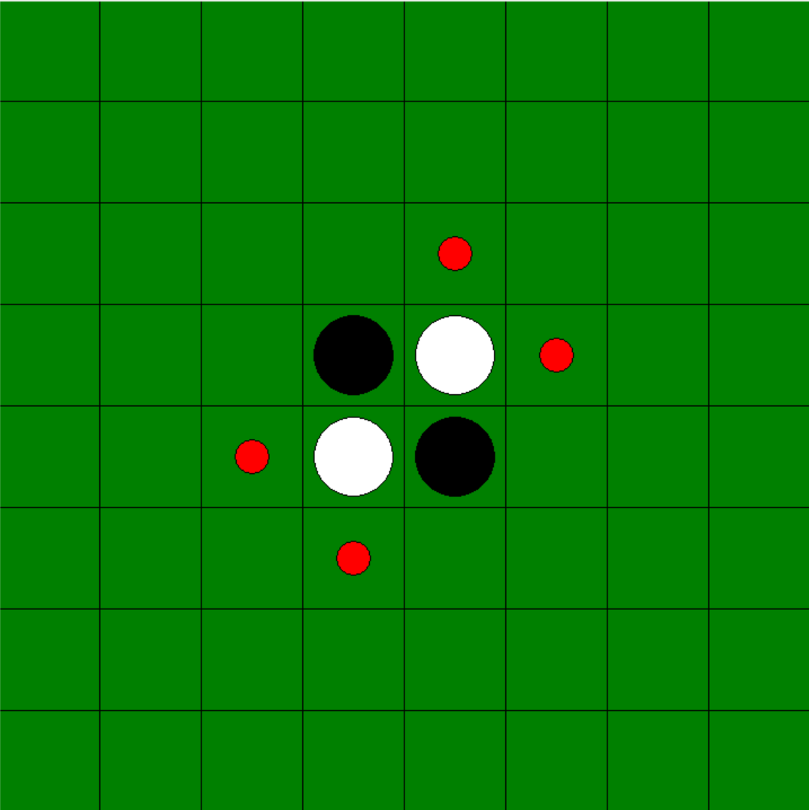

# 学校の課題で作成したものを改良 (Othello AI with Alpha-Beta Pruning)

Pythonで実装したオセロAIです。αβ法（Alpha-Beta Pruning）を用いた探索により、戦略性のある手を選びながら効率的に次の手を決定します。

## 特徴

- Python標準ライブラリのみで動作（外部ライブラリ不要）
- αβ法による高速な探索
- 評価関数による局面のスコアリング（位置ごとの重み付け）
- 対コンピュータプレイに対応（レベルによって強さの変動が可能）
- Tkinterを用いた直感的な操作が可能

## 工夫した点

- 計算コストを抑えるため、探索の深さと枝刈りの条件を調整
- 描画処理が重くならないように，変更される座標だけ表示し直す機能

## 実行方法
python client.py

### レベル選択

### ゲーム画面

